# 多 Agent 协作体系：从想法到落地的演进

> 本文记录的是搭建多 AI 工具协作体系的**思考过程**——不是最终方案的说明书，而是一路走来的取舍和弯路。具体工具名称只作举例，思路本身不绑定任何特定工具。

---

## 零、起点：一个人不够用了

大多数人用 AI 编程工具的方式是：打开一个对话，做一件事。工具不够聪明就换一个，配额用完就等明天。

问题出在你同时拥有多个 AI 工具的时候——每个都有明确的长板和短板：

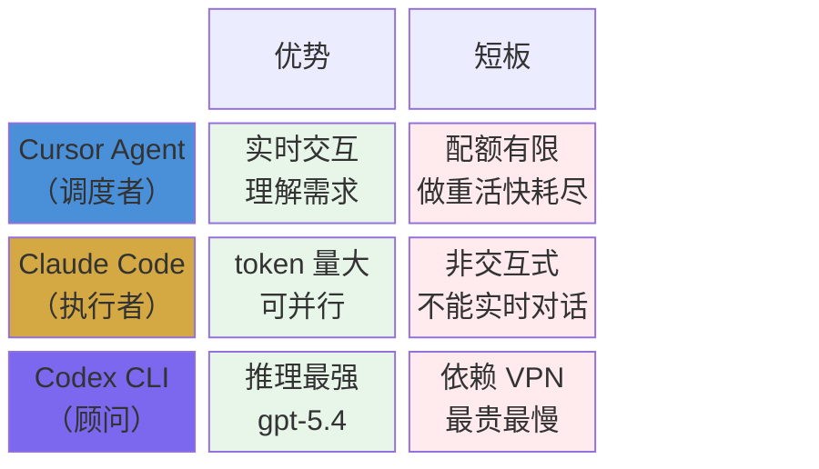

单独用任何一个，都会在某个维度上撞墙。**核心矛盾是：每个工具都有长板和短板，而你的任务不会只落在一个工具的舒适区里。**

自然的想法：让它们分工。

---

## 一、第一版：写一个大 Rule，告诉 AI 该怎么分工

最直觉的做法是写一个详细的全局规则（Rule），每次对话自动注入，告诉 Cursor：

- 你有 cc 和 codex 两个帮手
- 什么任务该派给谁
- 怎么调用、怎么降级

第一版 Rule 写了几十行，包含角色定义、模型选择决策树、调用模板、降级策略……基本上把所有你能想到的东西都塞进去了。

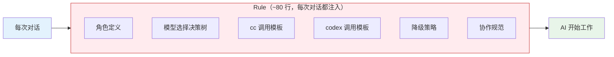

**问题马上来了：**

### 问题 1：Rule 太长，每次对话都要消耗大量 token

Rule 是每次对话都会注入的。写了 80 行的 Rule 意味着每次对话开头，AI 都要先"读"完这 80 行才开始干活。这些 token 大部分时候是浪费的——你 90% 的对话根本不需要协作。

### 问题 2：AI 过度热心地分工

Rule 里详细写了"什么任务该派给谁"，结果 AI 对着简单任务也开始分析"这个要不要派给 cc"。用户只是想改一行代码，AI 却先给你出了一个三方协作计划。

### 问题 3：调用模板写在 Rule 里，改一次就要重新测试全局生效

cc 的参数改了，或者 codex 的调用方式变了，你得去改 Rule。Rule 是全局的，改错了影响所有对话。

**教训：Rule 应该极简。它是"基础认知"，不是"操作手册"。**

---

## 二、第二版：拆分 Rule 和 Skill

解决第一版问题的思路是**分层**：

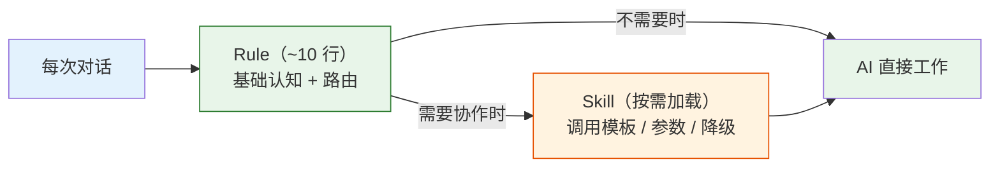

- **Rule（~10 行）**：只放最基本的认知——"你有 cc 和 codex 两个帮手，用户说用 cc 时调 cc，说用 codex 时调 codex"。每次对话都加载，但成本极低。
- **Skill（按需加载）**：完整的调用模板、参数说明、降级策略写成 Skill 文档，只有需要时才读取。

这解决了 token 浪费和模板维护的问题。但还剩一个核心问题：**什么时候该走完整的协作流程？**

如果让 AI 自己判断"这个任务需不需要多方协作"，它判断得并不好。有时候简单任务被过度拆解，有时候复杂任务它直接自己做了。

**教训：不要让 AI 判断"是否需要协作"。这个决定应该由用户来做。**

---

## 三、第三版：用户触发协作（/army 命令）

关键转折点是一个设计原则的确立：**协作是按需触发的，不是默认行为。**

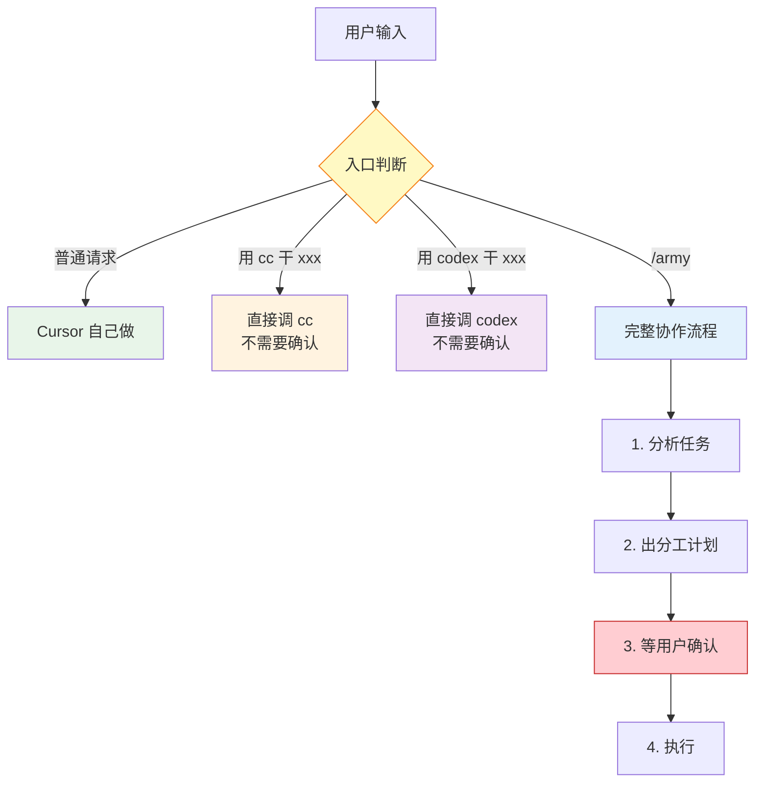

**为什么不让 AI 自动路由？** 因为用户对"这个任务值不值得多方协作"有自己的判断。自动路由带来的便利不如它造成的意外多——用户不知道 AI 什么时候会突然启动一个复杂的协作流程。明确的触发机制让用户有预期。

一个完整的 `/army` 调用看起来像这样：

```
[用户]  /army 重构 utils.py 中的日期处理函数

[Cursor] 分析任务 → 输出分工计划表 → 等用户确认

[用户]  确认

[Cursor] 写任务描述到 _agent_work/plans/refactor-date-20260404.md
[Cursor] 调用 cc：读 plans/... 执行重构
[cc]    执行完成，结果写到 _agent_work/context/cc-refactor-20260404.md

[Cursor] 读摘要，调用 codex review 未提交改动
[codex]  review 结果写到 _agent_work/reviews/codex-review-20260404.md

[Cursor] 读 review 摘要，向用户汇报
```

注意调度者（Cursor）全程只读摘要，不直接消费大段输出。

---

## 四、Skill 也太长了：子文档拆分

Skill 解决了 Rule 太长的问题，但 Skill 本身也会变长。当 cc 的调用模板、codex 的调用模板、协作文件规范、交接模板都放在同一个 SKILL.md 里时，它又变成了一个几百行的大文件。

而实际使用中，不同场景需要的信息不同：

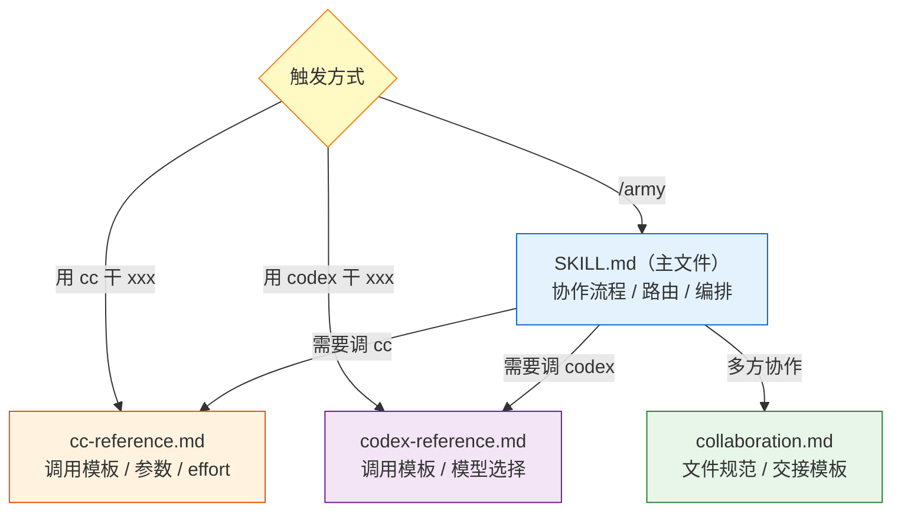

主文件始终加载，子文档按需引用。这样 token 消耗和信息精度都得到了优化。

---

## 五、协作文件：最容易被忽略的胶水

多 Agent 协作有一个隐蔽但致命的问题：**交接失灵**。

A 做完了，B 不知道 A 做了什么。Cursor 给 cc 派了任务，cc 把结果写到一个临时地方，Cursor 找不到。或者 cc 的输出直接回传给 Cursor，几千字的内容把 Cursor 的 token 消耗殆尽。

下面这个序列图展示了**正确的**协作文件流转方式：

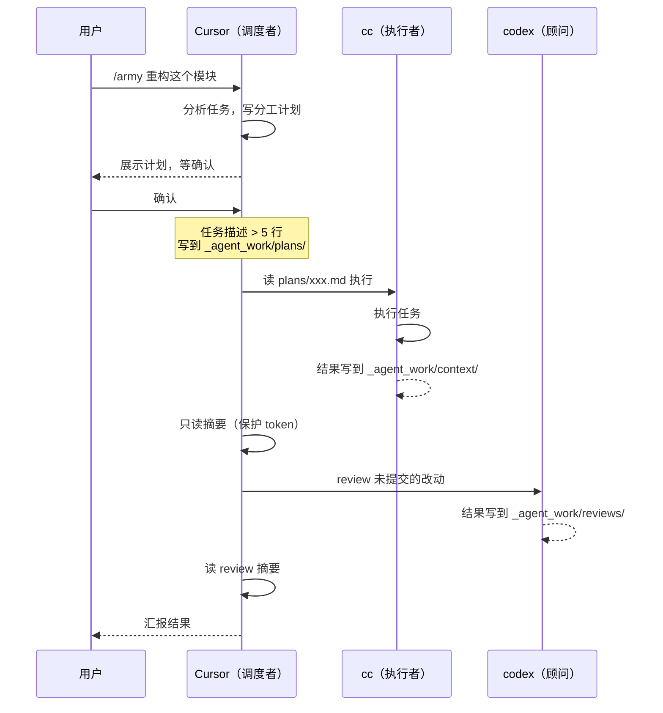

### 第一层：固定目录 + 命名规范

所有协作中间产物写到项目内的 `_agent_work/` 目录：

```
_agent_work/
├── context/    # 上下文搜集结果
├── plans/      # 分工计划和方案
├── reviews/    # review 结果
└── logs/       # 执行日志
```

文件名带日期和任务标识，不会互相覆盖。这个目录不加 `.gitignore`——它本身就是协作的活文档，值得被追踪。

**目录初始化**：调度者在首次派发任务时自动 `mkdir -p _agent_work/{context,plans,reviews,logs}`。不需要用户手动创建，也不需要预先存在——每次调用前确保目录在就行。

### 第二层：长任务描述写成文档

实际使用中发现一个模式：当你给 cc 或 codex 的任务描述超过 5 行时，直接放在命令行参数里不现实，也不可追溯。

更好的做法是：先把任务描述写到 `_agent_work/plans/` 下的一个 Markdown 文件里，然后让 cc/codex 去读这个文件执行。好处是：
- 任务描述有版本记录
- Cursor 自己不需要在 prompt 里塞大量文本
- 下次遇到类似任务可以复用

"5 行"是经验法则，不是硬性阈值。核心判断标准是：命令行里塞不塞得下、事后能不能追溯。

### 第三层：并行编排

当任务可以拆成互不依赖的子任务时，多个 cc/codex 实例可以并行跑。关键约束：**每个实例写独立文件，禁止并行写同一文件。**

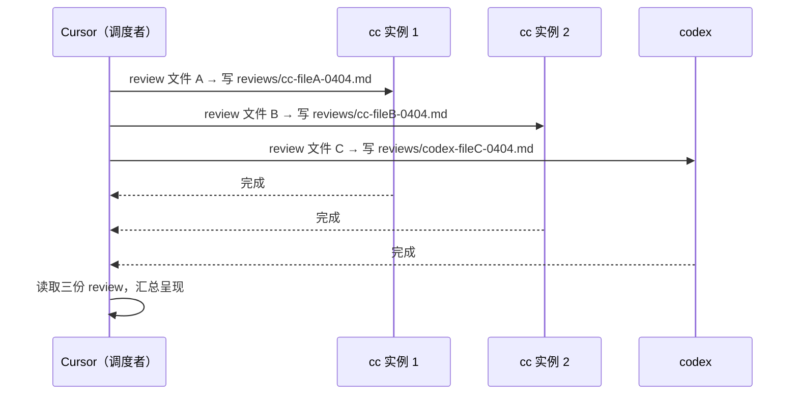

### 第四层：失败处理

工具调用不总是成功的。常见失败场景和应对：

| 失败场景 | 表现 | 应对 |
|---|---|---|
| codex 网络不通 | 可用性检测返回 `codex_unavail` | 降级到 cc `--effort high` 或 Cursor 自己做 |
| cc/codex 超时 | 后台进程长时间无输出 | 设合理 timeout，超时后检查产物文件是否已写入 |
| 输出文件为空或格式异常 | 文件存在但内容不符合预期 | 调度者检查文件大小，异常时重试或降级 |
| 并行实例部分失败 | 部分文件写入、部分缺失 | 汇总已有结果，对失败任务单独重试 |

原则是：**调用前检测，执行后验收，失败时降级。** 不要假设每次调用都成功。

---

## 六、让工具 review 自己

体系搭到这里，一个有趣的可能性出现了：**让 cc 和 codex 分别 review 这套体系本身。**

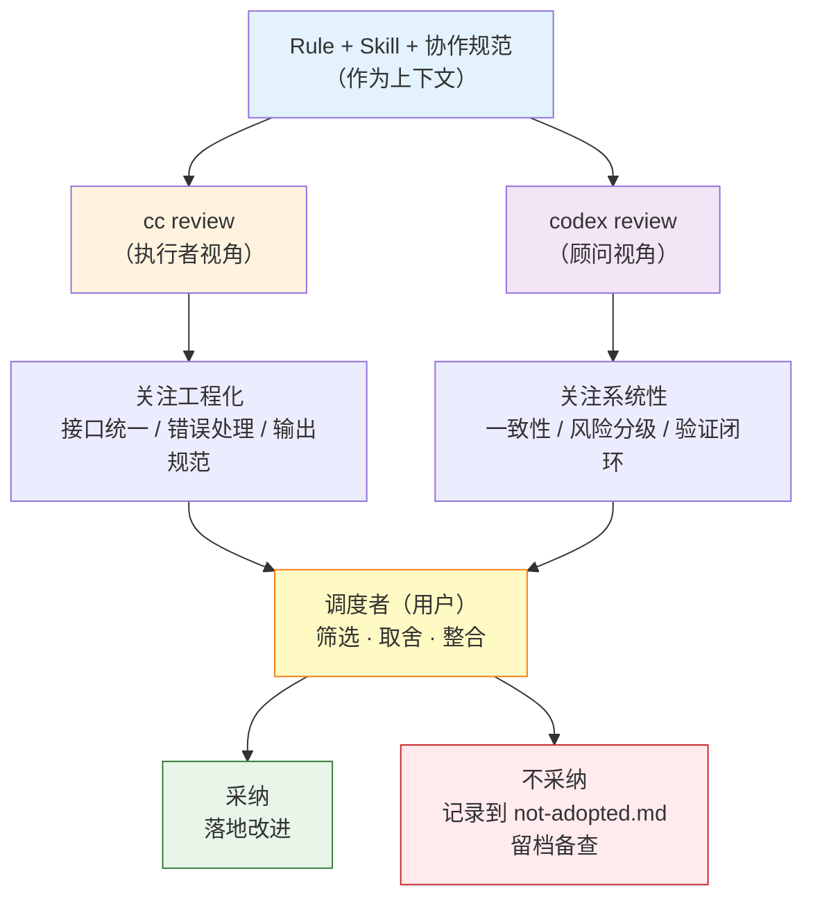

实际效果：
- cc 更关注工程化——接口统一、错误处理、输出规范
- codex 更关注系统性——一致性、风险分级、验证闭环
- 两者互补，比你自己想要全面得多

但也要注意：**不是所有建议都应该采纳。** 我们收到了结构化任务输入（JSON 模板）、错误码体系、权限三级细分、用量阈值自动调度等建议。逐一评估后，大部分"过度工程化"的建议被搁置——当前阶段，简单可用比架构完美重要。这些被搁置的建议和理由都记录在 `not-adopted.md` 里，作为未来的参考。

---

## 七、反模式：踩过的坑

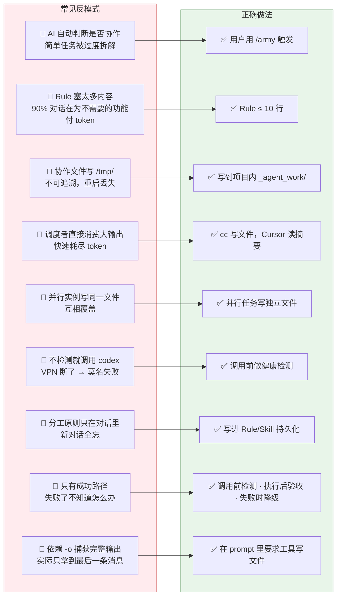

---

## 八、用数据 review 自己

体系搭到 V6，看上去已经很完善了——分层清晰、失败有降级、并行有规范。但有一个关键问题一直被忽略：**体系用起来之后，实际的分工比例到底怎么样？**

答案来自一个简单的操作：**回溯所有历史对话，统计三方工具各自做了多少。**

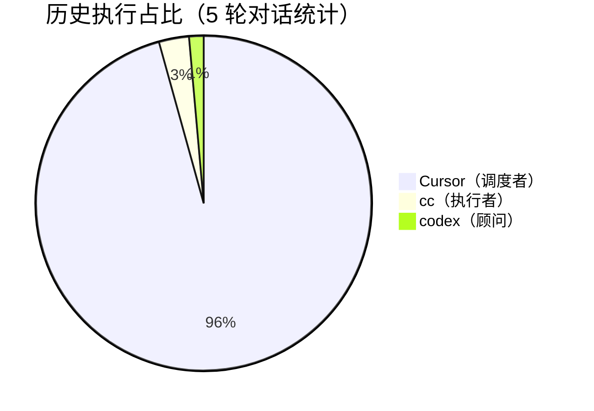

数据触目惊心：**调度者承担了 95.7% 的工作**。cc 只被调用了 8 次，codex 只被调用了 4 次。大量本该外派的批量编辑、多文件 review、文档产出，全是 Cursor 自己做的。

逐轮分析暴露了几个典型场景：

| 对话 | Cursor 操作 | cc 调用 | codex 调用 | 问题 |
|---|---|---|---|---|
| #1 初始化项目 | ~86 次 | 3 次 | 1 次 | 大量文件编辑自己做了 |
| #2 写 roadmap | ~29 次 | **0 次** | **0 次** | 完全没外派，用户当场批评 |
| #3 固化体系 | ~89 次 | 4 次 | 2 次 | 批量改 4-5 个文件本该派 cc |
| #4 review + 优化 | ~64 次 | 1 次 | 1 次 | 后续编辑又全自己做 |

**根因**：规则里虽然写了"什么任务该派给谁"，但这些规则只在 `/army` 流程里生效。日常对话中，AI 没有被强制触发外派意识——它总是默认自己做，因为这是阻力最小的路径。

### 修复：在 Rule 层加铁律

既然问题出在"日常对话不触发外派"，解决方式就是把外派条件写进每次对话都会注入的 Rule 里，而不是只写在 Skill 的 `/army` 流程中：

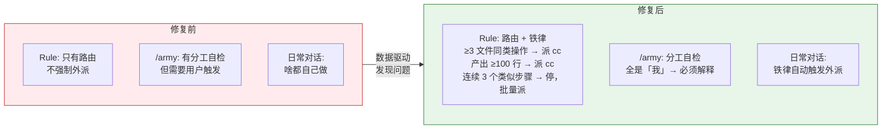

具体改动：
- **Rule 层**：新增铁律——≥3 文件同类操作、产出 ≥100 行、连续 3 个类似编辑步骤时必须外派，不需要 `/army` 也能触发
- **Skill 层（/army 计划阶段）**：新增自检清单——"我"的步骤 ≥5 个要审视，全是"我"做必须解释理由
- **Skill 层（路由矩阵）**：Cursor 自己做的边界从"小"收紧到"≤2 文件、≤50 行改动"，新增 cc/codex 速查条目

**教训：体系设计不能只靠直觉。定期用数据 review 实际执行情况，才能发现"规则写了但没执行"的盲区。**

这也揭示了一个更深层的问题：**AI 的默认行为是"自己做"，你必须用强制规则来覆盖这个默认行为。** 仅仅"建议"它外派是不够的——你需要设定明确的阈值和触发条件，让外派变成无需思考的条件反射。

---

## 九、最终架构：四层分离

经过上述演进，最终形成的架构是四层分离：

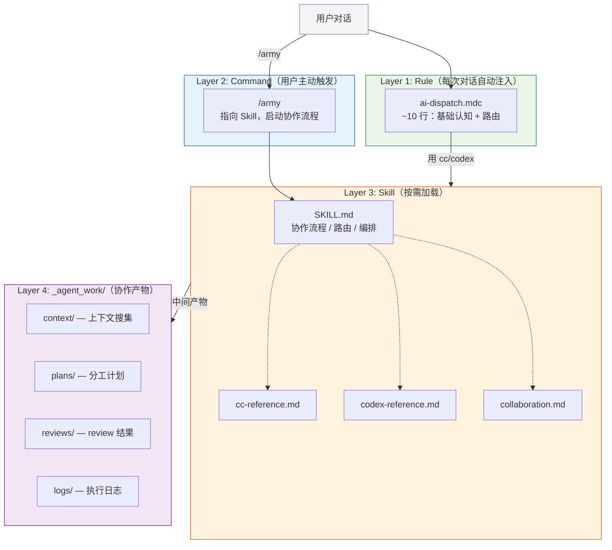

设计原则：
- 每次对话必付的成本（Rule）降到最低
- 偶尔需要的能力（Skill）按需加载
- 用户控制协作时机（Command），AI 不自作主张
- 协作产物有固定归属（`_agent_work/`），交接不失灵

---

## 十、从零搭建的步骤

如果你也想搭一套类似的体系，先确认前置条件：
- 至少两个 AI 编程工具已安装可用（一个交互式、一个可 CLI 调用）
- 工具的 API Key / 账号已配置好
- 如有工具依赖网络代理（如 VPN），确保代理可用

然后按以下步骤推进：

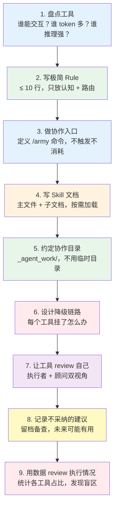

---

## 十一、总结

这套体系的本质是把**软件工程的分层思想**搬到 AI 工具的使用方式上：

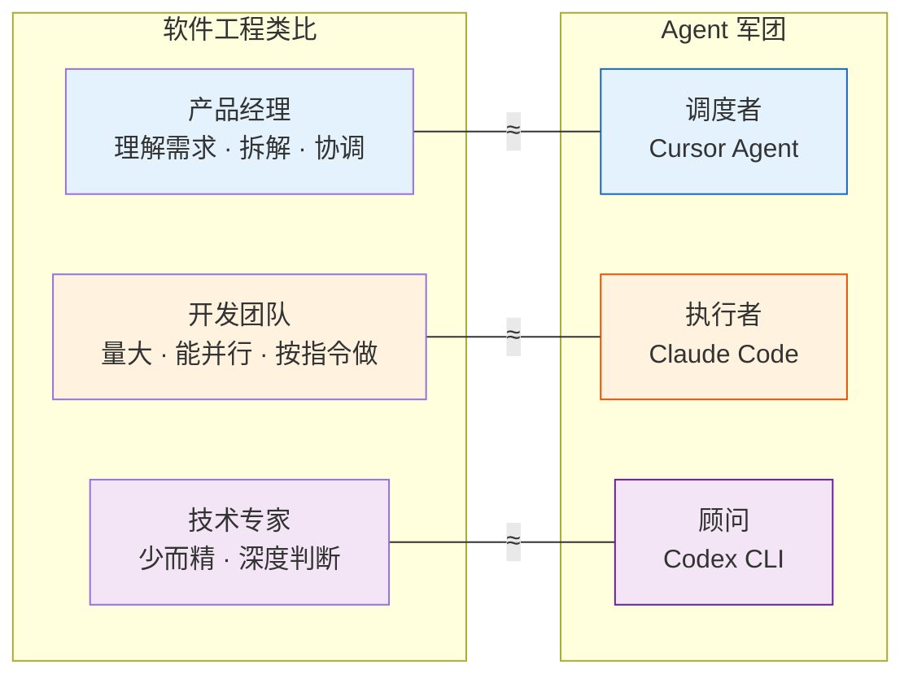

演进过程的核心取舍：

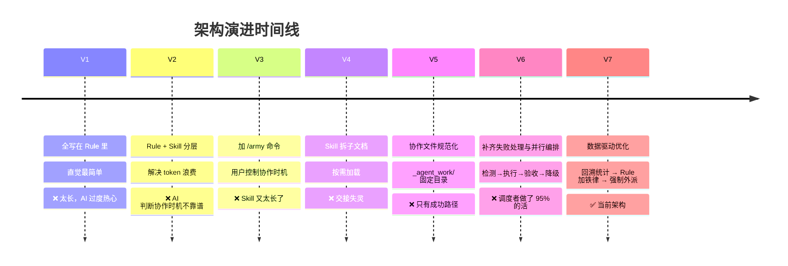

每一步都是在解决上一步暴露的问题。没有一开始就设计好的完美架构——都是用出来的。
